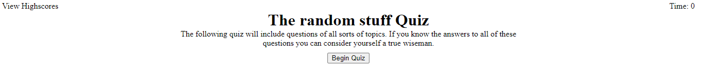

#Quiz Challenge (https://rafialmadrid.github.io/quizChallenge/) <-- Link to the deployed app

The following app will serve as a quick quiz challenge that asks the user 3 basic questions. The user has to answer the question in the least amount of time.

When the user begins, the timer starts counting down from 60. Every time the user get a wrong answer, the time will be cut by 10 seconds. 

Once done, the user can submit his score and store it. It can repeat the process and store the new results.